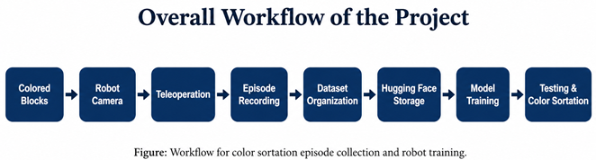

# Color Sortation Onboarding

Welcome to the Color Sortation documentation for the Trossen Mobile AI Robot project.

This repository explains the complete workflow for collecting color-based demonstration episodes, organizing the dataset, storing it on Hugging Face, and preparing it for robot training.

The task focuses on red, blue, and green colored blocks of different sizes. The robot is controlled through teleoperation, while its camera records demonstrations that will later be used for training color-based sorting behavior.

---

## How to Read This Documentation

Read the files in order. Each file explains one part of the project workflow.

| Step | File | Purpose |
|---|---|---|
| 1 | `01_project_overview.md` | Project goal, workflow, and task summary |
| 2 | `02_robot_setup.md` | Robot, camera, software, and setup requirements |
| 3 | `03_episode_collection.md` | Episode recording procedure |
| 4 | `04_dataset_organization.md` | Dataset folder structure and organization |
| 5 | `05_huggingface_storage.md` | Dataset storage and sharing on Hugging Face |
| 6 | `06_training_preparation.md` | Training preparation workflow |
| 7 | `07_troubleshooting.md` | Common issues and solutions |

---

## Project Workflow



```text
Colored Blocks
      ↓
Robot Camera
      ↓
Teleoperation
      ↓
Episode Recording
      ↓
Dataset Organization
      ↓
Hugging Face Storage
      ↓
Model Training
      ↓
Testing and Color Sortation


## Goal

The goal of this work is to prepare a structured dataset for training the Trossen Mobile AI Robot to recognize and sort colored blocks.

The dataset contains demonstration episodes recorded through teleoperation. These episodes show the robot observing and interacting with colored blocks under different positions and object-size variations.

