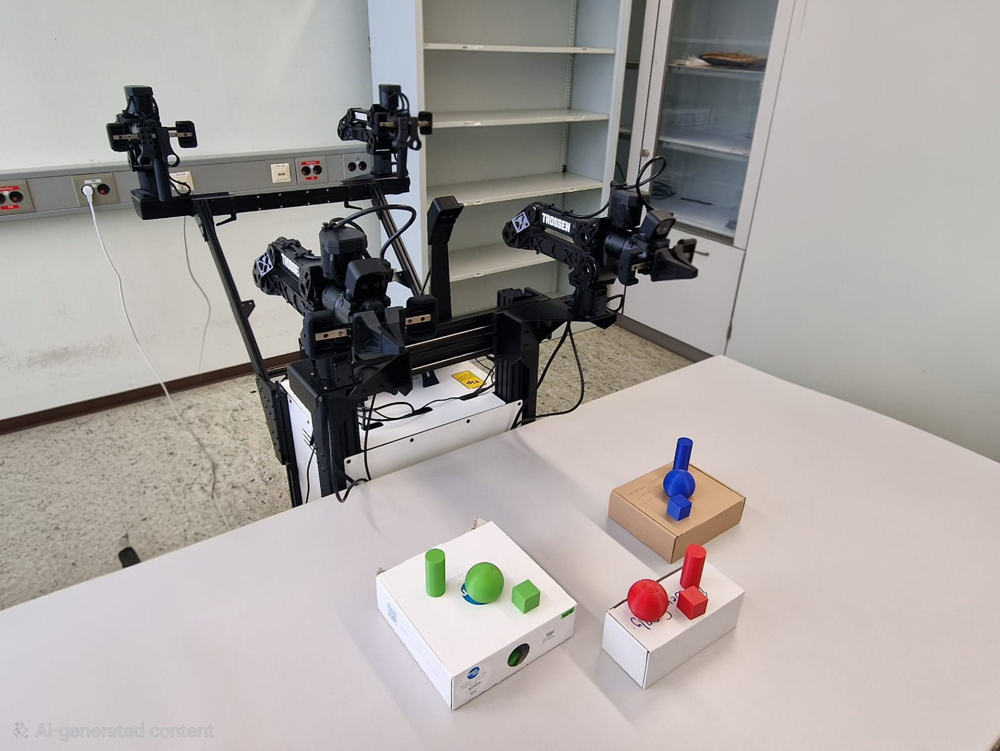
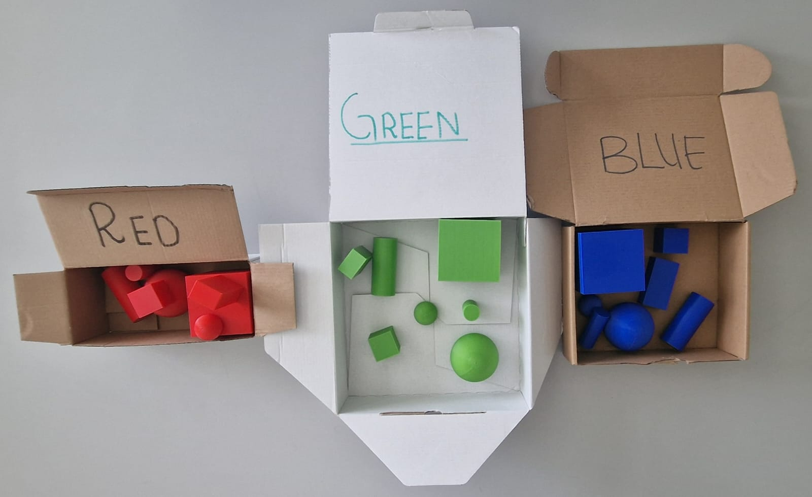

# Setup

This section explains how to prepare the robot, camera, software, and workspace before episode collection.

## Setup Checklist

Before recording, check the following:

- [ ] Robot is powered on.
- [ ] Robot is connected to the control computer.
- [ ] Camera stream is working.
- [ ] Teleoperation interface is open.
- [ ] Robot responds to control commands.
- [ ] Colored blocks are ready.
- [ ] Working area is clear.
- [ ] Dataset folder is prepared.
- [ ] Hugging Face storage is ready if data will be uploaded.

## Robot Setup

1. Place the Trossen Mobile AI Robot in the working area.
2. Power on the robot.
3. Connect the robot to the control computer.
4. Open the robot control software.
5. Confirm that the robot is detected.
6. Test basic movement using teleoperation.

## Camera Setup

1. Start the camera stream.
2. Check that the camera feed appears correctly.
3. Place a colored block in front of the robot.
4. Confirm that the block is clearly visible.
5. Adjust the block position if it is outside the camera view.
6. Check for blind spots before recording.

## Teleoperation Setup

1. Open the teleoperation interface.
2. Confirm that movement commands are working.
3. Move the robot slowly at first.
4. Test forward, backward, and turning movement.
5. Stop the robot and confirm that it responds correctly.

## Data Collection UI Setup

1. Launch the Data Collection UI.
2. Select the correct task configuration.
3. Check the camera view.
4. Confirm the robot configuration.
5. Run a dry test before recording.
6. Start recording only after setup verification.

## Workspace Setup

The workspace should be simple and clean.

Recommended setup:

- Colored block placed clearly in the robot view
- No extra objects around the block
- Stable lighting
- Clear path for robot movement
- Enough space for safe operation

## Setup Images

### Robot Setup

### Colored Blocks

### Camera View

